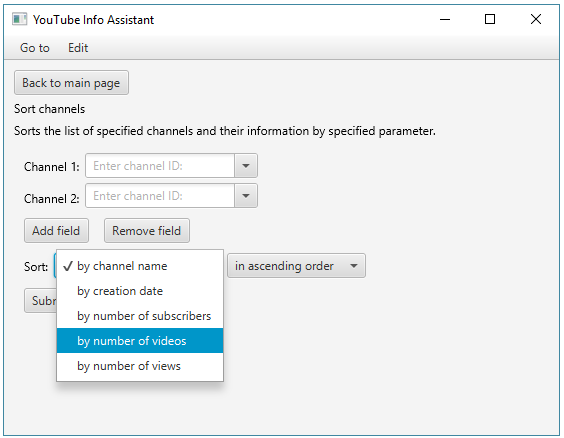

# YouTube Info Assistant

YouTube Info Assistant is a JavaFX application providing a user with YouTube channels statistics, collects data and allows to compare info for different channels.

YouTube Data API is used in this application to search for videos matching specific search terms, topics, locations, publication dates, etc.
Link to source: https://developers.google.com/youtube/v3/docs/

## Overview

The application allows a user to get up-to-date status of requested channel's indicators gross values. The following data can be retrieved per channel:
- total number of the channel's subscribers
- total number of the channel's videos
- total number of views of all the channel's videos
- total number of all comments of all the channel's videos

The application has several functions each of which returns specific view of query result through the user interface per unique data entry.

Welcome page:

Following by `Search for channels` the following set of options is available for a  user to perform specified query.

Search options details:
1. **Show channel info**
   Shows global information about a channel.
2. **Compare channels info**
    Shows global information about the list of specified channels.
3. **Sort channels**
    Sorts the list of specified channels and their information by specified parameter.
4. **Media resonans**
    Shows information (including total number of comments) about a channel.
5. **Compare media resonans**
    Shows information (including total number of comments) about the list of specified channels.
6. **Sort by media resonans**
    Sorts the list of specified channels and their information by total number of comments in advance.

By choosing `1. Show channel info` user is requested to input channel ID of any YouTube channel.

> Note: The names of already viewed channels are available in drop-down list.

Following `2. Compare channels info` a multiple choice is allowed to make it possible compare results for requested channels.

> Note: Press `Add field` or `Remove field` to control over quantity of input fields.

The following results view is shown to a user:

In order to get results already sorted  `3. Compare channels info` extended option is available as well. Sorting criteria and sorting order are available as result view parameters.

`Media resonans`, `Compare media resonans` and `Sort by media resonans` are similar queries containing, however, total number of comments for all videos available at the channel.

> Note: Use `Go to` in top menu panel to quickly switch between all query types or settings page.

### Settings
The following setting are available:
1. **Cache using**
    By enabling this option all search results are automatically saved to local memory. In case of repeated requests - data get request is addressed to local storage, instead of YouTube server, accordingly.
2. **Cache saving path**
    A path to a folder containing cached data.
3. **Execution time spent**
    By enabling this option query execution time spent is displayed at the bottom of each result view.

## Technical overview
- YouTube Data API
- JavaFX
- Unirest HTTP library
- fasterxml.jackson

| Property                   | Data type     | Description                                     |
|----------------------------|---------------|-------------------------------------------------|
| Channels:                   |               |                                                 |
| snippet.title              | string        | The channel's title                             |
| snippet.publishedAt        | datetime      | The date and time that the channel was created  |
| statistics.subscriberCount | unsigned long | The number of subscribers that the channel has  |
| statistics.videoCount      | unsigned long | The number of videos uploaded to the channel    |
| statistics.viewCount       | unsigned long | The number of times the channel has been viewed |
| statistics.commentCount    | unsigned long | The number of comments for the channel          |
| Videos:                     |               |                                                 |
| statistics.commentCount    | unsigned long | The number of comments for the video            |